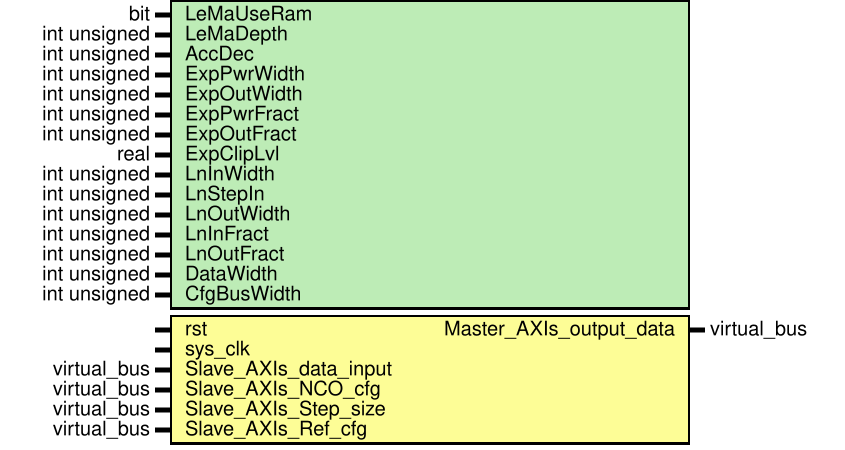

# Entity: AGC_matlab 
- **File**: AGC_matlab.sv
- **Title:**  Auto Gain Control (AGC) module

## Diagram

## Description

The automatic gain controller (AGC) block adaptively adjusts its gain to achieve a constant signal level at the output.
Based on https://www.mathworks.com/help/comm/ref/agc.html

## Generics

| Generic name | Type         | Value | Description                                                                                                                                            |
| ------------ | ------------ | ----- | ------------------------------------------------------------------------------------------------------------------------------------------------------ |
| LeMaUseRam   | bit          | 1'b0  | Parameter defines does moving average in level estimator use ram, 1'b0 - use shift regs based on LUT, 1'b1 - use block RAM                             |
| LeMaDepth    | int unsigned | 16    | Moving average depth in level estimator                                                                                                                |
| AccDec       | int unsigned | 2     | Optimisation partameter, amount of bits to reduce on the output of the diff accumulator                                                                |
| ExpPwrWidth  | int unsigned | 9     | exponent module power width                                                                                                                            |
| ExpOutWidth  | int unsigned | 24    | exponent module data output width                                                                                                                      |
| ExpPwrFract  | int unsigned | 6     | exponent module fractional part width                                                                                                                  |
| ExpOutFract  | int unsigned | 16    | exponent module width of output data fractional part                                                                                                   |
| ExpClipLvl   | real         | 50    | exponent module output clip level                                                                                                                      |
| LnInWidth    | int unsigned | 16    | Logaritm module parameters  ln input data width                                                                                                        |
| LnStepIn     | int unsigned | 5     | ln input argument integer part step, a power of two,   So input changes with a step of 2**step_in  If not equal to 1, then in_fract must be equal to 0 |
| LnOutWidth   | int unsigned | 16    | ln ouput width                                                                                                                                         |
| LnInFract    | int unsigned | 0     | ln input fractional part width                                                                                                                         |
| LnOutFract   | int unsigned | 11    | ln fractional part width                                                                                                                               |
| DataWidth    | int unsigned | 32    |                                                                                                                                                        |
| CfgBusWidth  | int unsigned | 32    |                                                                                                                                                        |

## Ports

| Port name               | Direction | Type        | Description                                                   |
| ----------------------- | --------- | ----------- | ------------------------------------------------------------- |
| rst                     | input     |             | rest input, synchronous active high                           |
| sys_clk                 | input     |             | system clock                                                  |
| Slave_AXIs_data_input   | in        | Virtual bus | input axi stream                                              |
| Slave_AXIs_NCO_cfg      | in        | Virtual bus | configuration axi stream, NCO configuration                   |
| Slave_AXIs_Step_size    | in        | Virtual bus | configuration axi stream, Step size                           |
| Slave_AXIs_Ref_cfg      | in        | Virtual bus | configuration axi stream natural logarithm of reference level |
| Master_AXIs_output_data | out       | Virtual bus | Output axi stream, 2 MS bytes-i (real), 2 LS bytes - q(im)    |

### Virtual Buses

#### Slave_AXIs_data_input

| Port name         | Direction | Type              | Description                             |
| ----------------- | --------- | ----------------- | --------------------------------------- |
| saxis_in_d_tdata  | input     | [  DataWidth-1:0] | 2 MS bytes-i (real), 2 LS bytes - q(im) |
| saxis_in_d_tvalid | input     |                   |                                         |
#### Slave_AXIs_NCO_cfg

| Port name        | Direction | Type              | Description |
| ---------------- | --------- | ----------------- | ----------- |
| saxis_nco_tdata  | input     | [CfgBusWidth-1:0] |             |
| saxis_nco_tvalid | input     |                   |             |
#### Slave_AXIs_Step_size

| Port name         | Direction | Type              | Description |
| ----------------- | --------- | ----------------- | ----------- |
| saxis_alfa_tdata  | input     | [CfgBusWidth-1:0] |             |
| saxis_alfa_tvalid | input     |                   |             |
#### Slave_AXIs_Ref_cfg

| Port name        | Direction | Type              | Description |
| ---------------- | --------- | ----------------- | ----------- |
| saxis_ref_tdata  | input     | [CfgBusWidth-1:0] |             |
| saxis_ref_tvalid | input     |                   |             |
#### Master_AXIs_output_data

| Port name          | Direction | Type              | Description |
| ------------------ | --------- | ----------------- | ----------- |
| maxis_out_d_tdata  | output    | [  DataWidth-1:0] |             |
| maxis_out_d_tvalid | output    | logic             |             |

## Instantiations

- Lvl_est: level_estimate
- ln_inst: log_nat_tabular
- Exp_inst: exponenta_tabular
