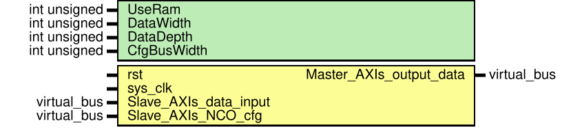

# Entity: level_estimator 
- **File**: level_estimator.sv
- **Title:**  Module for calculating the level of a complex signal

## Diagram

## Description

Module based on the alpha max beta min algorithm.  
More about algoritm https://en.wikipedia.org/wiki/Alpha_max_plus_beta_min_algorithm  
It is assumed that the data arrives at a rate exceeding the symbol rate.  

## Generics

| Generic name | Type         | Value | Description |
| ------------ | ------------ | ----- | ----------- |
| UseRam       | int unsigned | 0     |             |
| DataWidth    | int unsigned | 32    |             |
| DataDepth    | int unsigned | 16    |             |
| CfgBusWidth  | int unsigned | 32    |             |

## Ports

| Port name               | Direction | Type        | Description                                        |
| ----------------------- | --------- | ----------- | -------------------------------------------------- |
| rst                     | input     |             | rest input, synchronous active high                |
| sys_clk                 | input     |             | system clock                                       |
| Slave_AXIs_data_input   | in        | Virtual bus | input axi stream, upper half is I, lower half is Q |
| Slave_AXIs_NCO_cfg      | in        | Virtual bus | configuration axi stream, NCO configuration        |
| Master_AXIs_output_data | out       | Virtual bus | Output axi stream, 2 bytes unsigned                |

### Virtual Buses

#### Slave_AXIs_data_input

| Port name         | Direction | Type              | Description |
| ----------------- | --------- | ----------------- | ----------- |
| saxis_in_d_tdata  | input     | [  DataWidth-1:0] |             |
| saxis_in_d_tvalid | input     |                   |             |
#### Slave_AXIs_NCO_cfg

| Port name        | Direction | Type              | Description |
| ---------------- | --------- | ----------------- | ----------- |
| saxis_nco_tdata  | input     | [CfgBusWidth-1:0] |             |
| saxis_nco_tvalid | input     |                   |             |
#### Master_AXIs_output_data

| Port name          | Direction | Type              | Description |
| ------------------ | --------- | ----------------- | ----------- |
| maxis_out_d_tdata  | output    | [DataWidth/2-1:0] |             |
| maxis_out_d_tvalid | output    |                   |             |

## Instantiations

- nco_axis_inst: nco
- Mov_Av_I: mov_avg
- Mov_Av_Q: mov_avg
